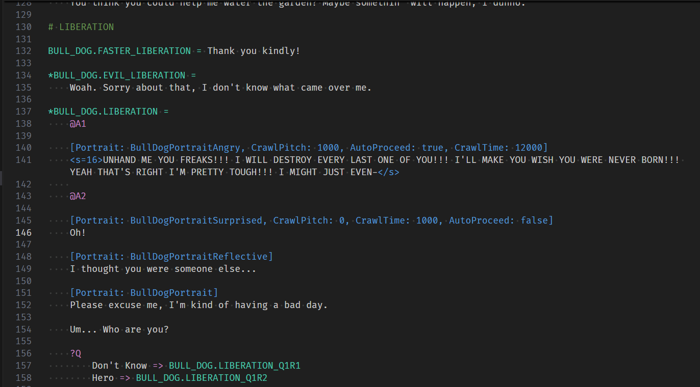

# .dial
.dial is the file type for translateable files in **Garbanzo Quest.**

Install this extension and all you'll need to know is that only the white text should be translated.

## How to install this extension:
1) **Download Zip** through the green Code button at the top of this GitHub page.
2) Extract the downloaded zip and open the extracted folder in VS Code.
3) Right Click **dial-0.0.3.vsix** and press **Install Extension VSIX**
4) That's it! You should now have syntax highlighting for .dial files.

